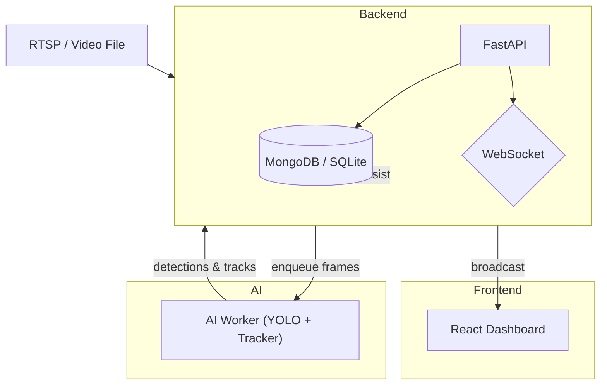

# Beach Assistant — AI-assisted beach safety monitoring (prototype)

A practical engineering prototype that connects computer-vision inference, multi-object tracking and a FastAPI backend to a React monitoring interface. The repository contains an AI pipeline (YOLO-[...]

This README is written as an engineering project overview — what is implemented, how the pieces fit together, how to run the system locally, and what remains experimental.

---

## Project overview

Beach Assistant demonstrates an end‑to‑end prototype pipeline for monitoring beach camera video and extracting swim‑related signals: person detection, multi‑object tracking, simple traject[...]

- `ai/` — inference and tracking code (YOLO detectors, tracker modules, analysis helpers)
- `backend/` — FastAPI service that orchestrates streams, stores data and broadcasts real‑time messages via WebSockets
- `frontend/` — React + TypeScript dashboard for live monitoring and alerting

The project is a research/prototype engineering effort intended for evaluation and demonstration. It is not a deployed, production beach monitoring service.

---

## Problem being explored

How to turn raw camera/video input into actionable, real‑time signals for an operator console: detect people, maintain persistent identities across frames, analyze short‑term trajectories and [...]

Key tradeoffs explored in the codebase include frame rate vs inference cost, filtering false positives near the shore, and designing a practical backend → frontend real‑time data flow that is [...]

---

## Engineering focus

- Reliable, modular AI inference pipeline (detection → tracking → analysis)
- Clear separation: AI worker(s) for heavy inference, backend for orchestration/APIs, frontend for UI
- Real‑time delivery using WebSocket streaming for low‑latency operator experience
- Simple, auditable alerting logic (rule‑based risk scoring) and local persistence for investigation
- Practical deployment patterns (Docker Compose, environment template files)

---

## System architecture (high level)



This repository supports local single‑host execution (all services on one machine) or split services (AI worker separate from backend). See the `docker-compose.yml` and individual `backend/` and[...]

---

## End-to-end data flow (short)

1. Camera or uploaded video is ingested by backend `stream_manager` / video processor.
2. Frames are queued (in‑memory or via Redis/queue) and consumed by the AI worker.
3. AI worker runs detection (YOLOv8) and tracking (ByteTrack/byte_tracker) to produce bounding boxes and track IDs.
4. Detection + track results are POSTed back to the backend ingestion endpoint.
5. Backend updates track history, runs simple behavior analysis and risk heuristics, creates alerts when thresholds are met, persists data and snapshots, and broadcasts messages to connected frontend clients over WebSocket.
6. Frontend receives real‑time messages and renders bounding boxes, trajectories and alerts in the dashboard.

---

## Key capabilities (what is implemented vs in progress)

Implemented / available in repo
- Local AI inference pipeline using YOLO model files found in `ai/` (detection implementation and model loader).  
- Multi‑object tracking modules (ByteTrack/byte_tracker or similar) and track history handling.  
- FastAPI backend with REST endpoints and a WebSocket `/ws/feed` for real‑time messages (`backend/` contains routes, models and services).  
- React dashboard code to render video frames, detection overlays and an alerts list (frontend skeleton and components under `frontend/src`).  
- Environment templates (`.env.example`) and documentation (detailed `docs/` material describing architecture and design decisions).  

Prototype / experimental / partial
- Frontend features are in progress — several components (video feed, WebSocket integration, alerts) are present but integration status is marked as in‑progress in `frontend/README.md`.  
- AI pipeline includes proof‑of‑concept pose/advanced analysis components in docs/designs; some are optional/experimental (pose estimation, anomaly ML models).  
- Multi‑camera scale and production hardening (security, auth, encrypted credentials, robust cloud deployment) are not implemented by default and require engineering work.

Planned / future (documented, not implemented)
- Mobile operator app, integrated SMS/Email alerting, production‑grade cloud deployment and advanced pose‑based drowning detection are listed as future improvements in the docs.

---

## Technology stack (extracted from the repository)

- AI / CV: YOLO (Ultralytics YOLOv8), OpenCV, PyTorch (where used)  
- Tracking: ByteTrack-style tracker / Kalman smoothing modules  
- Backend: Python, FastAPI, Pydantic models, WebSockets  
- Frontend: React 18 + TypeScript, Vite, Tailwind CSS (project contains React components and UI scaffolding)  
- Persistence & infra: MongoDB or SQLite examples in docs; local storage for snapshots; optional Redis/queue for buffering  
- Local deployment: Dockerfiles and docker-compose.yml included (for multi-container local development)

(All technologies listed are referenced in repository files and docs. Check individual component READMEs for exact dependency lists.)

---

## Project structure (top-level)

```
Beach-Assistant/
├── ai/             # AI inference & tracker code (models, loader, analysis)
├── backend/        # FastAPI backend (API endpoints, WebSocket, services)
├── frontend/       # React dashboard (UI components, hooks, services)
├── docs/           # Architecture, plans and reports
├── docker-compose.yml
├── .env.example
├── requirements.txt
└── README.md       # <-- you are here
```

For component‑level details see `backend/README.md`, `frontend/README.md` and the extensive `docs/` folder which contains ARCHITECTURE.md, FRONTEND_PLAN.md and BACKEND_PLAN.md.

---

## Setup — prerequisites (local development)

- Python 3.8+ and a virtual environment for the Python services
- Node.js 16+ for the frontend
- Optional: Docker & Docker Compose to run services in containers
- Optional: GPU drivers + CUDA if you want GPU inference performance for YOLO

---

## Quick local run (recommended minimal test flow)

Note: these steps assume local development (no cloud services). They are written to match the code layout; adjust environment variables as needed.

1) Clone the repo

```bash
git clone https://github.com/bardan8586/Beach-Assistant.git
cd Beach-Assistant
```

2) Start the backend (local Python venv)

```bash
# from repo root
cd backend
python -m venv .venv
source .venv/bin/activate  # or .\.venv\Scripts\activate on Windows
pip install -r requirements.txt
# create a .env using backend/.env.example or root .env.example
uvicorn app.main:app --reload --host 0.0.0.0 --port 8000
```

3) Start the frontend

```bash
cd frontend
npm install
npm run dev
# frontend expects VITE_API_URL / VITE_WS_URL to point to the backend (see .env.example)
```

4) Run the AI pipeline against a test video (optional)

```bash
cd ai
python3 -m venv venv
source venv/bin/activate
pip install -r requirements.txt
# run inference against a local file
python main.py path/to/test_video.mp4
# or use SHOW_WINDOW=true for local preview
```

The repository includes `test_playback_api.py` and `tests/` helper data for local end‑to‑end experiments (see `test_playback_api.py` for a scripted playback/ingest test).

---

## API & WebSocket overview (implemented endpoints)

Backend exposes REST and WebSocket interfaces (see `backend/README.md` for full reference):

- GET `/api/health` — health check  
- POST `/api/data/ingest` — AI worker → backend ingestion for frame detections and tracks  
- GET `/api/swimmers?camera_id=...` — active swimmers  
- GET `/api/alerts` — recent alerts  
- WS `/ws/feed?camera_id=...` — subscribe to real‑time feed (detections, tracks, alerts)

Messages on the WebSocket are JSON objects carrying detection arrays, track updates and alert objects. Check `backend/app/api/websocket.py` and `frontend/src/hooks/useWebSocket.ts` (or similar) f[...]

---

## AI / CV pipeline (engineering details)

- Detector: Ultralytics YOLOv8 (model files referenced in `ai/models` or configured via `MODEL_NAME`). The code supports using a local YOLO model or a Roboflow integration when configured.
- Tracker: ByteTrack‑style tracker implemented in `ai/tracking` (byte_tracker / kalman smoothing) to assign persistent IDs across frames.
- Filtering & scene analysis: Modules exist for shore/horizon detection and filtering candidates by size/position to reduce false positives near the beach boundary.
- Analysis: `behavior_analyzer` and `risk_engine` (or `risk_engine.py` in some paths) calculate basic heuristics such as stationary time, zone violations and a composite risk score used by the `a[...]

Implementation notes
- The codebase provides configuration variables to tune thresholds (confidence, IOU, min size ratios) and to switch detector types. See `.env.example` for environment keys.  
- Pose estimation and advanced ML anomaly detectors are present as optional/experimental components in the repo/docs — they are not required for the basic detection→tracking→alert pipeline.

---

## Current status (accurate, evidence‑based)

- Backend: implemented FastAPI service with REST endpoints and WebSocket handler (see `backend/`). Code and documentation exist. The repo's backend README lists available endpoints and local run [...]
- AI pipeline: detection and tracking components are present under `ai/`. Model files and loaders are referenced and the repository includes scripts to run inference on local video.  
- Frontend: React dashboard skeleton and many components exist under `frontend/`; the frontend README notes some components are still "In Progress" (video feed, WebSocket integration and some UI [...]

Summary: the repository contains a functioning prototype stack intended for local testing and demonstration. It is not a turnkey production deployment out of the box — frontend integration and [...]

---

## Limitations & known constraints

- Not a production deployment: no managed cloud infrastructure or tested global deployment is included in this repo.  
- Performance will vary by hardware and model selection. The default CPU inference path will be slower than GPU.  
- Multi‑camera scaling is a design goal but requires deployment/operational work (worker scaling, queue infrastructure, monitoring) before production use.  
- False positives/scene assumptions: shore detection and precise distance estimation from a single monocular camera have inherent limitations; results depend on camera angle, resolution and model[...]
- Sensitive configuration: `.env.example` is safe; do not commit real credentials. I inspected `.env.example` and there are no secret keys committed. Keep credentials out of the repo.

---

## Future improvements (documented in `docs/`)

- Improve pose‑based signals and advanced drowning heuristics (research + labeled data required)  
- GPU‑accelerated inference & batch processing for higher FPS  
- End‑to-end integration tests with sample RTSP streams and synthetic events  
- Authentication & RBAC for the dashboard  
- Optional integrations: SMS/Email escalation, incident export, mobile responder app

---

## Tests and sample playback

- `test_playback_api.py` provides a scripted way to post frames/video to the backend ingestion endpoint for end‑to‑end playback testing.  
- There is a `tests/` folder with sample data; run the backend and AI pipeline in local mode for integration experiments.

---

## Security checks performed

- I inspected `.env.example` and repository files for accidentally committed credentials. I did not find API keys, passwords, or secrets committed in the repository files I reviewed.  
- Recommendation: continue to ensure real credentials are only stored in local `.env` files or in secure secret stores and never committed to Git.

---

## How you can use this repo (suggested small experiments)

- Run the `ai/main.py` against a short test video and POST results to `backend` via `POST /api/data/ingest` to see real‑time messages in the frontend.  
- Run `uvicorn app.main:app` in `backend/` and start `frontend` dev server to experiment with the dashboard overlays.  
- Use `test_playback_api.py` to simulate frames being processed and verify alert generation logic.

---

## Contribution & license

This repository is maintained as an open engineering prototype. Contributions that improve reliability, documentation, testability and safety are welcome. Please open issues for bugs or propose P[...]

*License*: see repository root for any license file. If no explicit open source license file is present, treat this code as project work and request clarification for reuse.

---

*If you want, I can now:*
- commit this README to the default branch (message: `docs: redesign Beach-Assistant README`), or
- adjust wording in any section before committing.

I will not modify application source files; this change affects only the root README.
