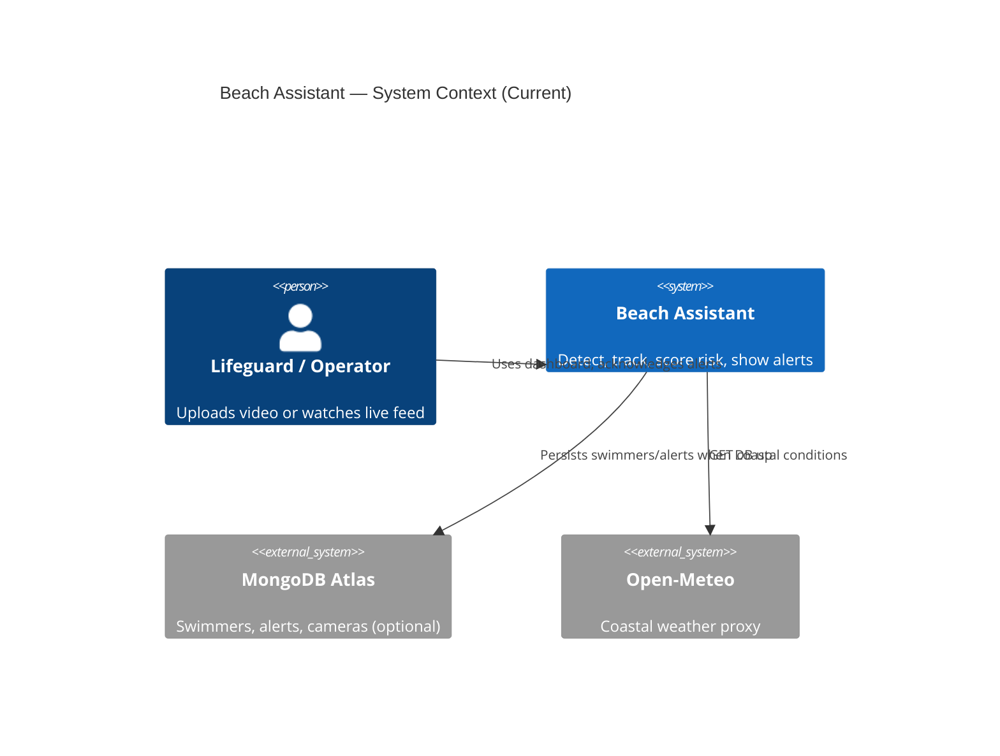
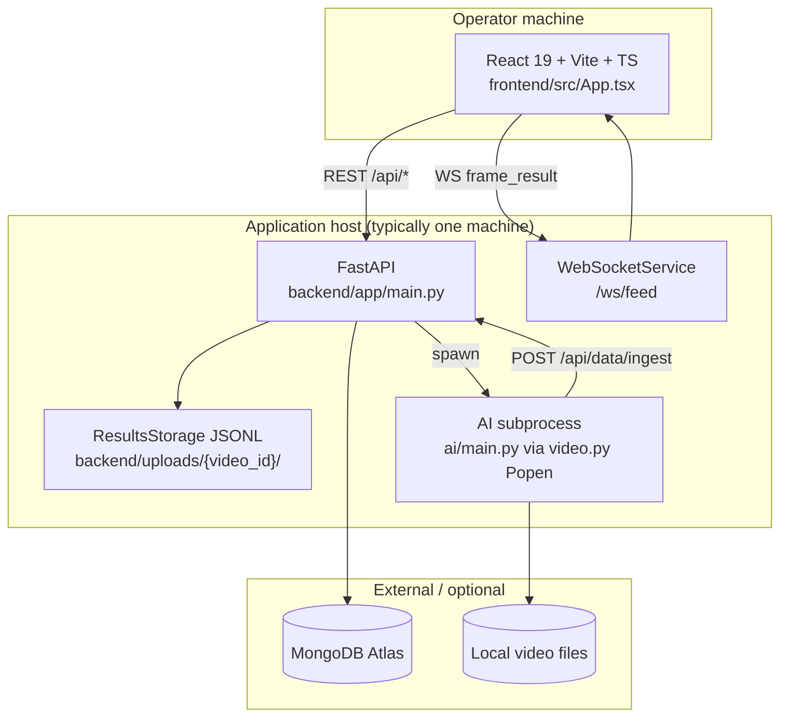
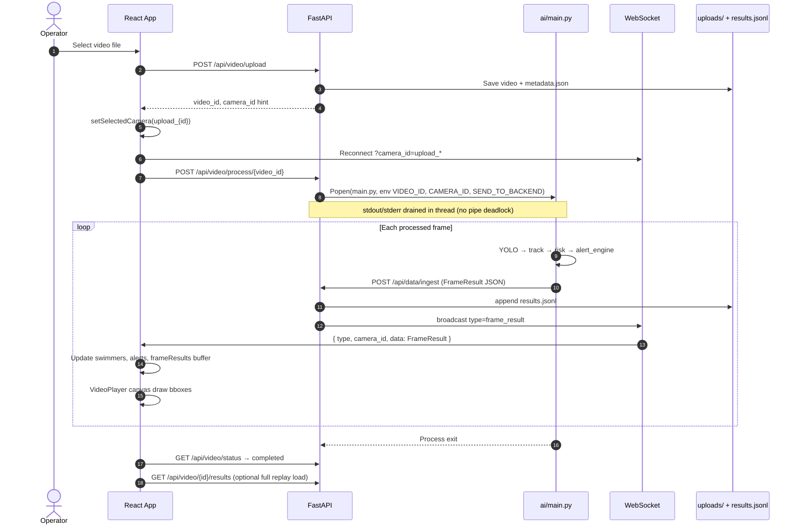
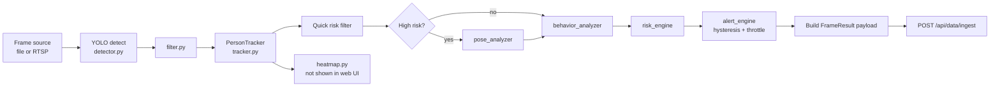
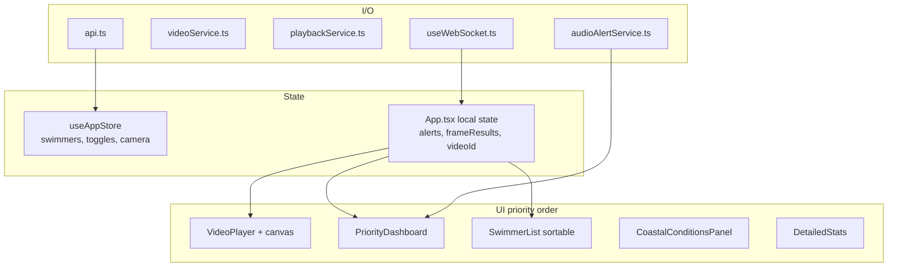
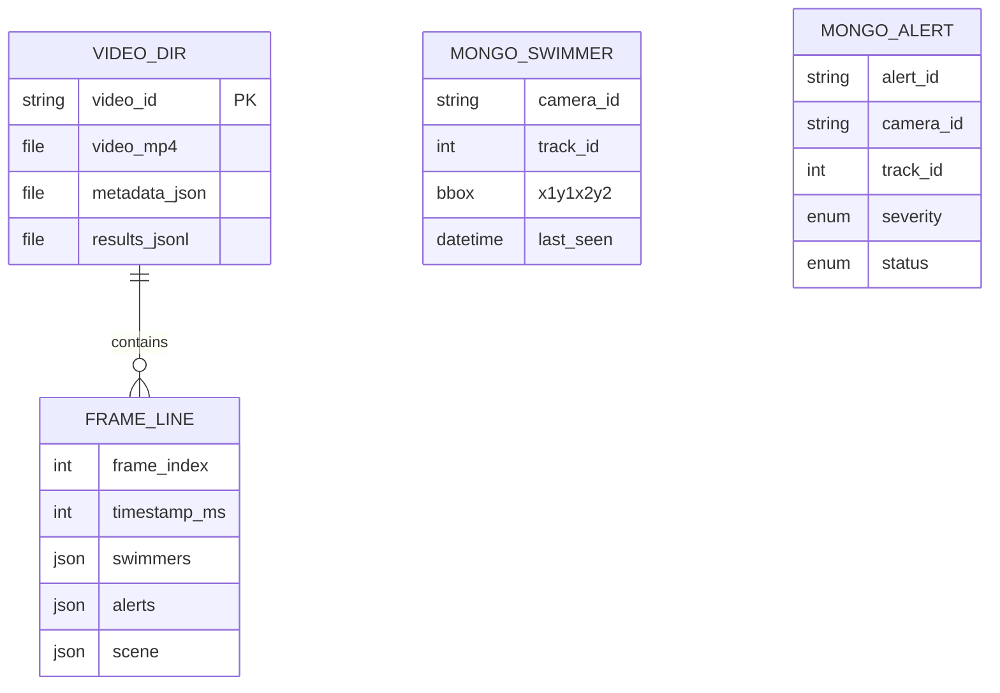

# Current Architecture (As-Built)

Beach Assistant is a **decision-support prototype**: computer vision on beach/pool video, risk heuristics, and a web dashboard for lifeguard-style operators. It does **not** replace human supervision.

---

## System context

---

## Container view (what runs where)

---

## Repository layout (major modules)

| Area | Path | Role |
|------|------|------|
| **AI pipeline** | `ai/main.py` | Frame loop: detect → track → analyze → risk → alert → ingest |
| **Detection** | `ai/detector.py`, `ai/config.py` | YOLOv8 / Roboflow; fine-tuned `best.pt` default |
| **Tracking** | `ai/tracker.py`, `ai/advanced_tracker.py` | Norfair / ByteTrack-style IDs |
| **Scene & zones** | `ai/scene_analyzer.py`, `ai/water_analyzer.py` | Shore line, horizon, SAFE/CAUTION/DANGER |
| **Risk & alerts** | `ai/risk_engine.py`, `ai/alert_engine.py` | Score 0–100; WATCH/ALERT/EMERGENCY with hysteresis |
| **Pose (staged)** | `ai/pose_analyzer.py` | YOLOv8-Pose on high-risk tracks only |
| **Backend API** | `backend/app/routes/*.py` | REST + WS |
| **Ingest** | `backend/app/routes/ingest.py` | FrameResult → JSONL + WS + Mongo swimmers |
| **Video ops** | `backend/app/routes/video.py` | Upload, spawn AI, status, playback results |
| **Models** | `backend/app/models/frame_result.py` | Master schema AI ↔ backend ↔ frontend |
| **Frontend** | `frontend/src/App.tsx` | Single-page ops dashboard |
| **Video UI** | `frontend/src/components/VideoFeed/VideoPlayer.tsx` | Canvas overlays synced to `<video>` |
| **Alerts UI** | `frontend/src/components/Lifeguard/PriorityDashboard.tsx` | Top-3 queue |
| **Realtime** | `frontend/src/hooks/useWebSocket.ts` | `ws://host/ws/feed?camera_id=` |

---

## Current data flow (upload → dashboard)

Primary path today is **uploaded MP4/MOV**, not tower RTSP.

---

## AI pipeline (per frame)

**Performance knobs:** `FRAME_SKIP` (default 2), optional `MULTI_SCALE_DETECTION`, pose only on high-risk subset.

---

## Frontend architecture (current)

**Not present:** React Router, auth, multi-camera grid, incident export, server-hosted video streaming (uses blob URL from upload).

---

## Backend API surface (current)

| Method | Path | Handler |
|--------|------|---------|
| GET | `/health` | `main.py` |
| GET | `/api/swimmers` | `routes/swimmers.py` |
| POST | `/api/data/ingest` | `routes/ingest.py` |
| GET/PATCH | `/api/alerts`, `/api/alerts/{id}` | `routes/alerts.py` |
| GET/POST/PATCH | `/api/cameras` | `routes/cameras.py` |
| POST | `/api/video/upload` | `routes/video.py` |
| POST | `/api/video/process/{id}` | `routes/video.py` |
| GET | `/api/video/status/{id}` | `routes/video.py` |
| GET | `/api/video/list` | `routes/video.py` |
| GET | `/api/video/{id}/results` | `routes/video.py` |
| GET | `/api/coastal/conditions` | `routes/coastal.py` |
| WS | `/ws/feed?camera_id=` | `routes/websocket.py` |

---

## Storage model (current)

**Dual alert paths:** AI emits `AlertData` inside `FrameResult` (live UI). Mongo `Alert` model (`backend/app/models/alert.py`) uses different enums (`low/medium/high/critical`) — **not fully wired from ingest**.

---

## Deployment reality (current)

| Aspect | Current state |
|--------|-------------|
| Docker | Documented in `docs/ARCHITECTURE.md`; **no Dockerfile in repo** |
| CI/CD | None observed |
| Auth | None |
| TLS | Dev HTTP only |
| GPU | Optional local CUDA; subprocess uses `ai/venv` |
| Scaling | Single process; in-memory WS connection map |

---

## Known limitations (honest)

1. **Upload-first**, not production RTSP/WebRTC ingest.
2. **Monolithic AI** in one Python process spawned by API — not a separate inference service.
3. **Alerts** live primarily in WebSocket frames; Mongo alert persistence from ingest is incomplete.
4. **Swimmer DB records** lack risk/zone fields (ingest maps bbox only to `SwimmerCreate`).
5. **No automated tests** in CI; a few scripts under `tests/` and `test_playback_api.py`.
6. **Heatmap** computed in AI but not rendered in web UI.
7. **docs/ARCHITECTURE.md** at repo root describes aspirational PostgreSQL/Redis layout — **differs from as-built Mongo + JSONL**.

See [02-target-architecture.md](./02-target-architecture.md) for the intended evolution.
