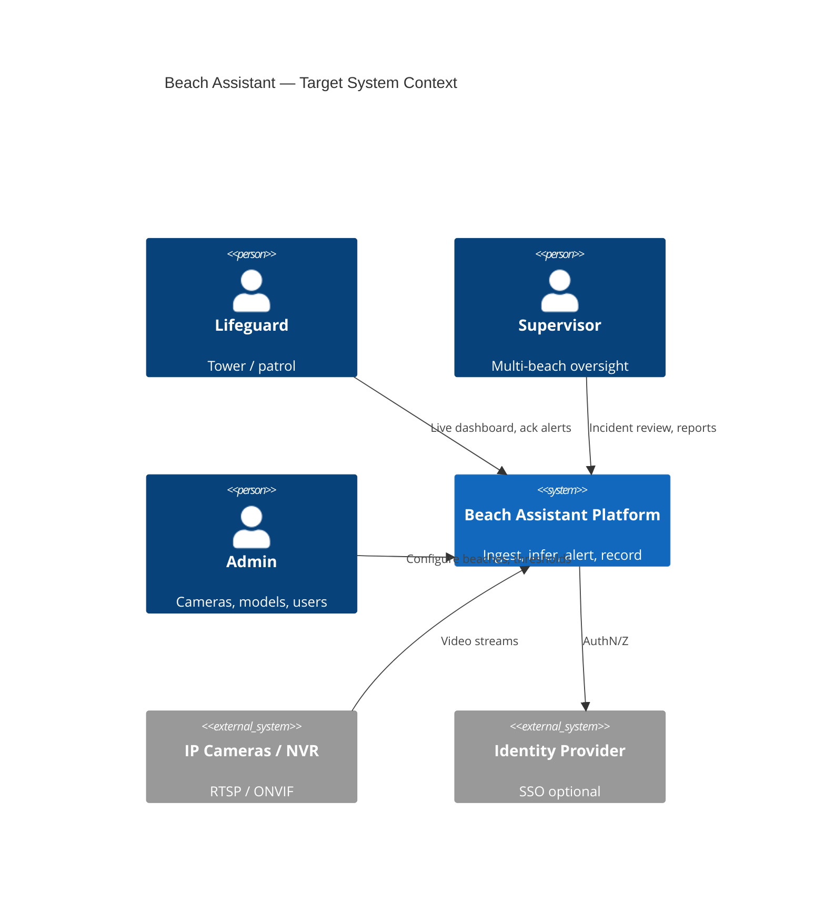
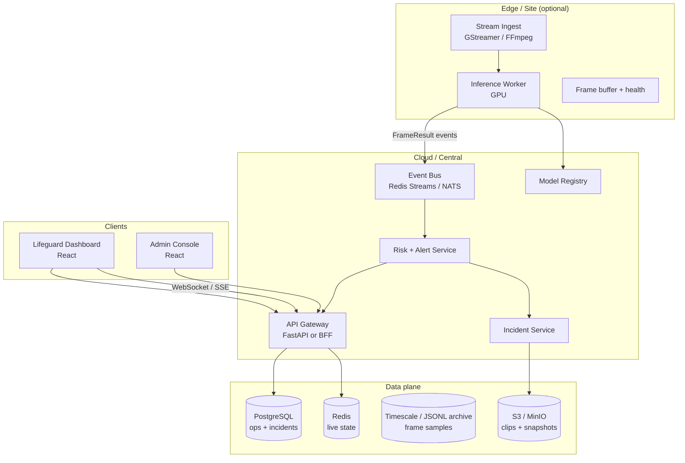
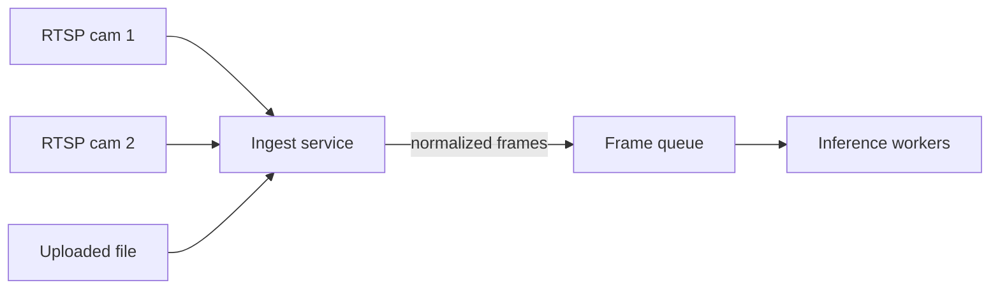
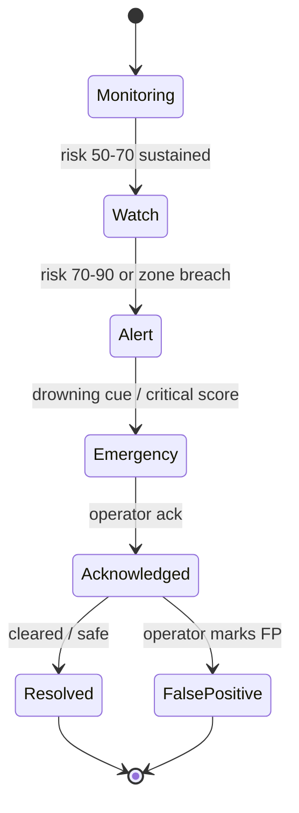
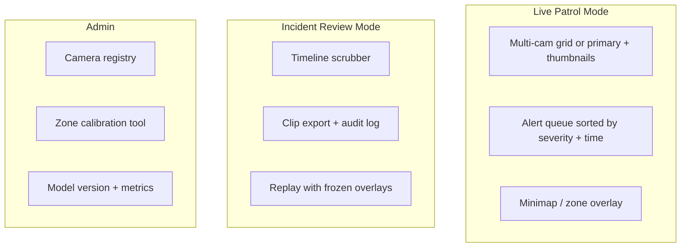
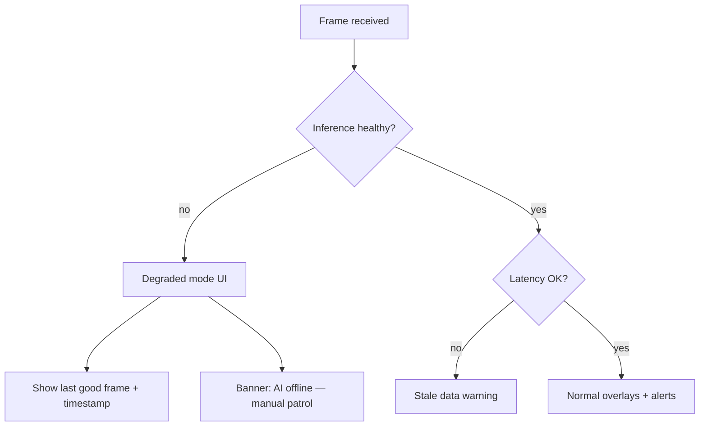
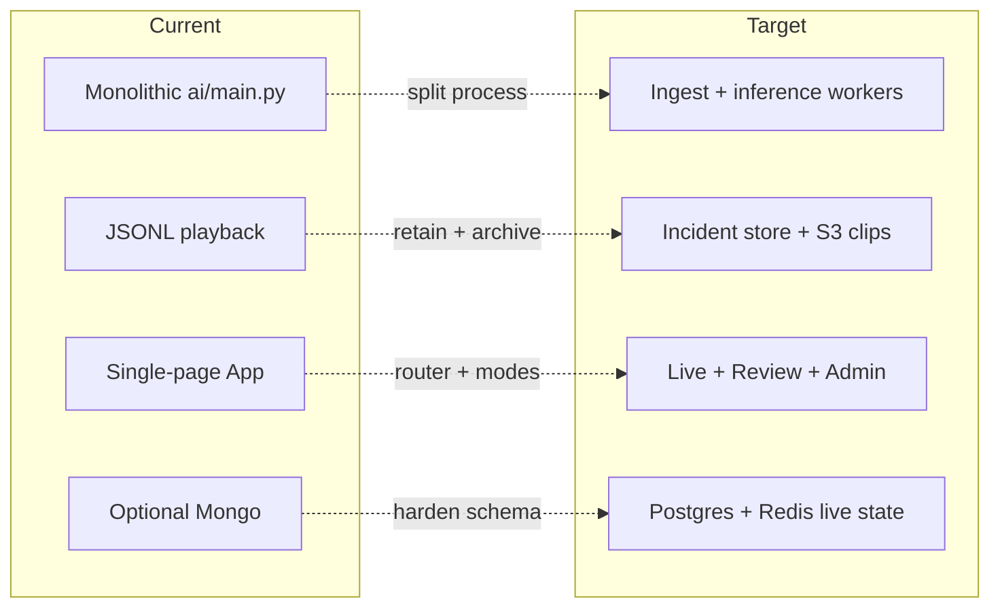

# Target Architecture (Production-Oriented)

This document describes a **credible target** for Beach Assistant as an aquatic-safety computer-vision product — not a rewrite spec. Migrate incrementally from the [current architecture](./01-current-architecture.md).

**Design principles**

- Human-in-the-loop always; system = **decision support**, not autonomous rescue.
- Fail-safe: degraded modes (AI down → last frame + explicit banner), never silent green status.
- Explainable alerts: reason codes, confidence, factors — not black-box scores only.
- Edge-first option for latency; cloud for multi-site ops and model management.

---

## Target system context

---

## Target containers (microservices-lite)

Start with **logical services**; can remain one repo, multiple processes, then split repos later.

---

## Camera ingestion layer

**Requirements**

- Per-camera health: FPS, last frame age, decode errors.
- Automatic reconnect with backoff.
- Per-beach calibration profile (shore line, zone polygons) stored in DB, not hard-coded.
- Optional edge box: Jetson / NUC runs ingest + inference; cloud only for UI + incidents.

---

## Inference & tracking services

| Service | Responsibility | Tech direction |
|---------|----------------|----------------|
| **Detection** | Person / swimmer classes | YOLOv8/11 fine-tuned per domain; versioned weights |
| **Tracking** | Stable track IDs | ByteTrack / BoT-SORT; re-ID on occlusion |
| **Scene** | Shore, horizon, static zones | CV + optional homography from calibration UI |
| **Behavior** | Motion, velocity, stationarity | Kalman + optical flow supplement |
| **Pose** | Distress cues | Staged on high-risk only (keep current pattern) |
| **Risk** | Multi-factor score | Configurable weights per beach |
| **Alert** | Hysteresis, dedup, escalation | Single alert service owns state machine |

---

## Frontend target (two apps or two modes)

**UX rules**

- Video + alert queue always above fold.
- One audio policy; per-severity mute.
- Every alert: reason, factors, recommended action, confidence band.
- Tablet landscape layout; control-room dual-monitor layout.

---

## Fail-safe design

- No “API Online” without health checks (already improved in current app).
- Alert pipeline idempotent: dedupe by `(camera_id, track_id, reason, window)`.
- Incident actions append-only audit log.

---

## GPU / CPU strategy

| Deployment | Inference | API / UI |
|------------|-----------|----------|
| Local demo | CPU `yolov8n` or Apple MPS | localhost |
| Cloud demo | 1× T4/L4 GPU worker | Render/Railway + Atlas |
| Pilot site | Edge GPU (Jetson Orin) or 1× cloud GPU per 2–4 cams | VPC + TLS |
| Multi-site | GPU pool + queue depth metrics | Regional API |

---

## Observability (target)

- **Metrics:** frames/sec, inference ms, ingest errors, WS clients, alert rate, FP rate (operator-marked).
- **Logs:** structured JSON; correlation id per `video_id` / `camera_id`.
- **Tracing:** optional OpenTelemetry from ingest → WS broadcast.
- **Dashboards:** Grafana — not required for student demo, required for pilot.

---

## Security (target minimum)

- JWT or session auth; roles: `lifeguard`, `supervisor`, `admin`.
- RTSP credentials in secrets manager, never in frontend.
- Rate limits on upload; virus scan optional for uploads.
- PII: face blur option for stored clips (jurisdiction-dependent).

---

## Gap: current → target (summary)

See [04-roadmap.md](./04-roadmap.md) for staged delivery.
