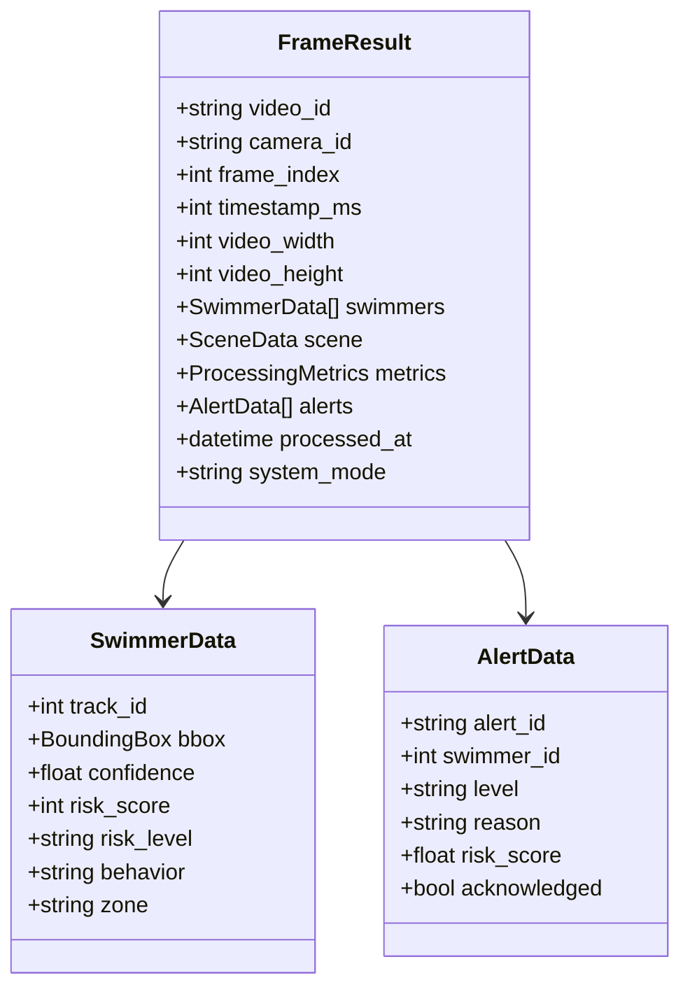
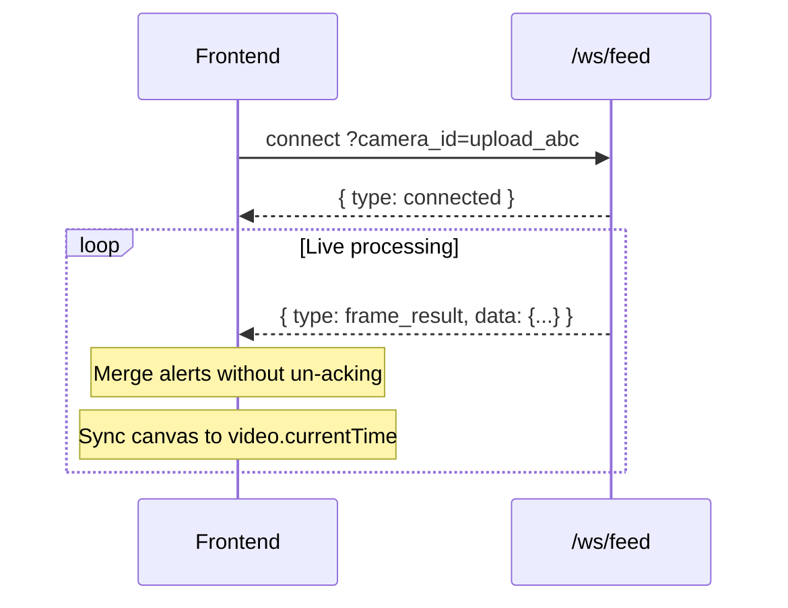
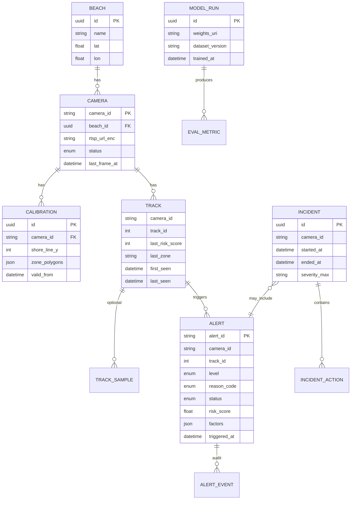

# Data Flow, Schemas & APIs

## Canonical schema: `FrameResult`

Defined in:

- `backend/app/models/frame_result.py` (Pydantic, source of truth server-side)
- `frontend/src/types/frameResult.ts` (TypeScript mirror)



**Ingest rule (current):** always serialize with `frame_result.to_websocket_message()` before JSONL write and WebSocket broadcast.

---

## WebSocket protocol (current)

**URL:** `ws://{host}/ws/feed?camera_id={id}`  
**Subscribe:** `all` or `upload_{uuid_prefix}` or `cam_001`

### Server → client messages

| type | payload | Notes |
|------|---------|-------|
| `connected` | `{ camera_id, message }` | On connect |
| `frame_result` | `{ camera_id, data: FrameResult }` | Primary live path |
| `swimmers` | legacy | Older format; App still handles |
| `alert` | legacy | Per-alert broadcast (unused from ingest today) |



### Recommended WebSocket improvements (target)

| Change | Why |
|--------|-----|
| `seq` monotonic per camera | Detect gaps / replay |
| `heartbeat` + server `pong` | Detect half-open connections |
| `alert_delta` events | Smaller payloads than full frame |
| `snapshot` on connect | Hydrate state after refresh |
| Version field `protocol: 2` | Safe upgrades |

---

## REST API improvements (target)

### Standard envelope

```json
{
  "success": true,
  "data": { },
  "error": null,
  "request_id": "uuid"
}
```

### Suggested resource map

| Resource | Current | Target |
|----------|---------|--------|
| Cameras | `/api/cameras` | + `health`, `calibration` |
| Streams | — | `POST /api/streams/{id}/start` |
| Live state | `/api/swimmers` (thin) | `/api/cameras/{id}/tracks` with risk fields |
| Alerts | `/api/alerts` | Unified with `AlertData`; `POST .../ack`, `.../resolve`, `.../false_positive` |
| Incidents | — | `/api/incidents` CRUD + timeline |
| Frames | `/api/video/{id}/results` | Paginated `?cursor=` + range |
| Models | — | `/api/models` versions + metrics |
| Health | `/health` | + `components: { db, redis, inference }` |

---

## Database design (target)

### Problem today

- **Two alert models:** `AlertData` (frame) vs `AlertInDB` (Mongo enums differ).
- **Swimmer records** missing `risk_score`, `zone`, `behavior` at persistence layer.
- **Frame history** only in JSONL per video, not queryable at scale.

### Proposed collections / tables



### Redis (live layer, target)

| Key pattern | Value | TTL |
|-------------|-------|-----|
| `cam:{id}:tracks` | Hash track_id → JSON snapshot | 30s refresh |
| `cam:{id}:alerts:active` | Sorted set by severity | 1h |
| `cam:{id}:frame:latest` | Last FrameResult | 10s |

---

## AI pipeline metrics (evaluation target)

| Metric | Use |
|--------|-----|
| Detection mAP@0.5 | Model quality on beach dataset |
| MOTA / IDF1 | Tracking stability |
| Alert precision/recall | Per reason code, hold-out videos |
| Time-to-alert | Latency from distress onset (simulated) |
| FP rate per hour | Operator-marked false positives |
| Zone accuracy | % swimmers with correct SAFE/CAUTION/DANGER |

Store runs in `MODEL_RUN` + dashboard in admin app.
