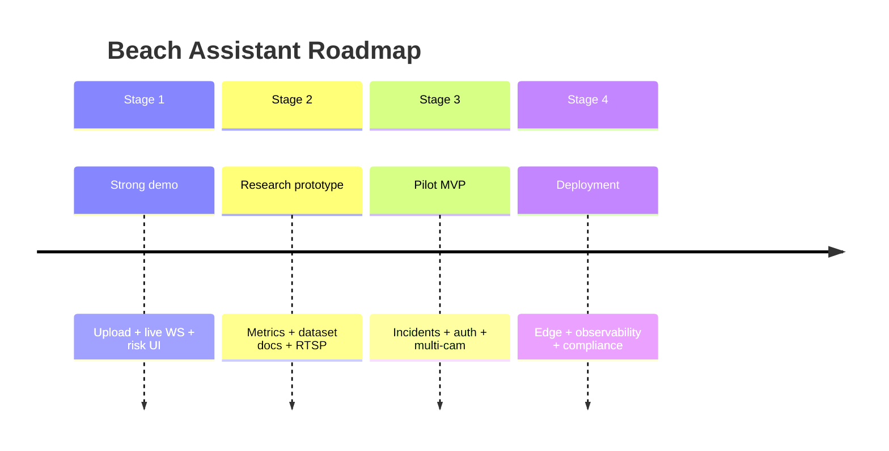

# Product & Technical Roadmap

Four stages from **credible demo** to **deployment-ready**. Do not skip validation gates.

---

## Overview

---

## Stage 1 — Stronger student / prototype demo

**Goal:** End-to-end demo works reliably in one command; experts see intentional engineering.

| Area | Build | Validation |
|------|-------|------------|
| Web pipeline | Stable ingest + WS + playback (Phase A done) | 8 min video, 0 ingest errors |
| Dashboard | Video-first layout, sortable swimmers, focus mode (Phase B done) | Operator can ack + focus in <3 clicks |
| DX | `docker-compose` or `scripts/start.sh`, `.env.example` aligned | New machine setup <30 min |
| Docs | This `docs/architecture/` folder | README points here |

**Impress experts:** Clean `FrameResult` contract, hysteresis alerts, honest disclaimers in UI.

**Do not overclaim:** “Prevents drowning”, “production lifeguard system”, “real-time beach deployment”.

---

## Stage 2 — Research-grade prototype

**Goal:** Defensible ML + systems story for thesis, grants, or competition.

| Area | Build | Validation |
|------|-------|------------|
| Dataset | Document all `tests/data` sources + license | Table in report |
| Evaluation | Script: mAP, tracking IDs, alert FP on labelled clips | Numbers in `docs/report.md` |
| RTSP | Wire `video_input.py` to backend stream registry | 1 IP camera or simulated RTSP |
| Alerts DB | Persist `AlertData` from ingest → Mongo/Postgres | Ack survives page reload |
| Calibration | Store shore line per `camera_id` | Two different beach videos |

**Risks to reduce:** Schema drift, unbounded JSONL size, unmeasured false alerts.

---

## Stage 3 — Pilot-ready MVP

**Goal:** One real organization could trial on one beach for a season with supervision.

| Area | Build | Validation |
|------|-------|------------|
| Auth | JWT + roles | Only supervisors resolve incidents |
| Incidents | Timeline, actions, clip export | Audit log immutable |
| Multi-camera | 2–4 streams, health panel | Degraded cam visible in UI |
| Inference service | Separate worker process + queue | API stays responsive under load |
| Mobile | Responsive tablet layout | Usable at 1024×768 |

**Impress experts:** Incident audit trail, per-beach calibration, measured FP rate.

**Do not overclaim:** Regulatory approval, insurance liability transfer.

---

## Stage 4 — Deployment-ready architecture

**Goal:** Operate continuously with monitoring, security, and edge option.

| Area | Build | Validation |
|------|-------|------------|
| Edge | Jetson package or NUC image | <500ms inference @ 720p with skip |
| Cloud | Terraform/K8s or managed GPU | Auto-restart, alerts on downtime |
| Observability | Prometheus + Grafana | SLO: 99% frames <2s latency |
| Privacy | Retention policy, blur option | Legal review checklist |
| Compliance | Runbooks, on-call, model rollback | Tabletop incident drill |

---

## Stage comparison table

| Dimension | Stage 1 | Stage 2 | Stage 3 | Stage 4 |
|-----------|---------|---------|---------|---------|
| Video input | Upload | Upload + RTSP | Multi RTSP | Edge + cloud |
| Auth | None | Optional | Required | SSO |
| Incidents | None | Basic log | Full workflow | Export + compliance |
| ML metrics | Informal | Published | Monitored | Continuous eval |
| Deploy | Local | Local + doc | Staged pilot | HA production |
