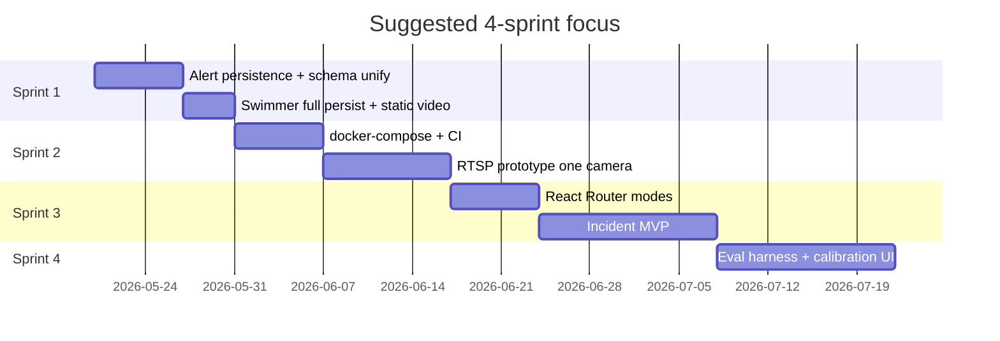

# Top 20 Engineering Priorities

Ranked by **impact on credibility and demo reliability**. Difficulty: S (small), M (medium), L (large).

| # | Task | Why it matters | Likely files | Approach | Diff | Outcome |
|---|------|----------------|--------------|----------|------|---------|
| 1 | RTSP / live stream ingest | Real product = tower cameras, not upload only | `ai/video_input.py`, new `backend/app/routes/streams.py`, `frontend` camera picker | MediaMTX or FFmpeg pull → same FrameResult path | L | Live beach cam on dashboard |
| 2 | Persist alerts from ingest | Ack + history must survive reload | `ingest.py`, `alert_repository.py`, new mapper AlertData→AlertInDB | On ingest, upsert alerts; PATCH ack writes DB | M | Durable alert queue |
| 3 | Unify alert schemas | Two models confuse API and UI | `alert.py`, `frame_result.py`, `types/alert.ts` | Single enum map: watch/alert/emergency ↔ storage | M | One mental model |
| 4 | Extend swimmer persistence | REST list missing risk/zone | `ingest.py`, `swimmer.py`, `swimmer_service.py` | Pass full SwimmerData fields on upsert | S | REST matches WS |
| 5 | `docker-compose` dev stack | Reproducible demo for reviewers | `docker-compose.yml`, Dockerfiles for api + frontend | API + mongo + optional ai worker profile | M | One-command demo |
| 6 | React Router: Live / Review / Admin | Single App.tsx won't scale | `frontend/src/App.tsx` → `pages/*`, `router` | react-router; move upload to Review | M | Clear product modes |
| 7 | Incident entity + audit log | Commercial pilots need accountability | New `incidents` route/repo/model, `App.tsx` actions | Append-only `incident_actions` on ack/safe/rescue | L | Defensible workflow |
| 8 | Per-camera calibration API | Shore line varies per beach | `cameras.py`, `beach_calibration.py`, UI form | Store `shore_line_y`, polygons in DB | M | Zones match reality |
| 9 | WebSocket protocol v2 | Gap detection, smaller payloads | `websocket_service.py`, `useWebSocket.ts` | seq + heartbeat + snapshot on connect | M | Reliable live ops |
| 10 | Inference worker split | API must not run GPU in child Popen | `video.py` → queue job; `ai/worker.py` | Redis RQ or separate systemd service | L | Stable under load |
| 11 | Evaluation harness | Experts ask for numbers | `tests/eval/`, labelled JSON | COCO-style metrics on held-out clips | M | Reportable mAP/FP |
| 12 | Heatmap or remove | Dead toggle erodes trust | `heatmap.py`, `VideoPlayer.tsx` | Either render from AI grid or delete toggle | S | UI honesty |
| 13 | Auth (JWT) + roles | Multi-user pilots | `main.py` middleware, `frontend` login | FastAPI OAuth2 password or Clerk | L | Tenant-ready |
| 14 | Clip export on incident | Insurance / training | `video.py`, ffmpeg subprocess | Extract segment by timestamp_ms range | M | Shareable evidence |
| 15 | Static file serving for uploads | Server replay without re-upload | `main.py` StaticFiles mount | `/media/{video_id}/video.mp4` | S | Shareable URLs |
| 16 | CI: lint + tsc + pytest smoke | Regressions caught early | `.github/workflows/ci.yml` | Backend import test + frontend build | S | Green main |
| 17 | Structured logging + request_id | Debug production issues | `logger.py`, middleware | JSON logs; propagate to AI subprocess | S | Faster triage |
| 18 | Risk factor explainability in UI | Trust = why alert fired | `risk_engine.py`, `PriorityDashboard.tsx` | Expose `factors[]` in FrameResult | M | Operators understand alerts |
| 19 | False positive feedback loop | Improve alert_engine | `alert_engine.py`, API `POST .../false_positive` | Increment `false_alarms` per track; tune thresholds | M | Lower cry-wolf |
| 20 | Model registry + version pin | Reproducible inference | `config.py`, admin UI, env `MODEL_VERSION` | S3 weights + DB row per deploy | L | Safe rollbacks |

---

## Suggested implementation order (next 4 sprints)

---

## What to implement first?

Pick one lane:

1. **Reliability lane** — items 2, 3, 4, 5, 16 (durable data + docker + CI)
2. **Product lane** — items 1, 6, 7, 14 (RTSP + incidents + routing)
3. **ML credibility lane** — items 11, 18, 19, 20 (metrics + explainability + feedback)

Tell which lane (or single task #) to implement next.
