# Beach Safety AI: Deep Learning for Swimmer Detection and Drowning Risk Assessment

**MAI600 Assessment 3 — Group Project Report**  
**Word count: ~3,000 words**

---

## 1. Introduction and Problem Statement

Drowning remains a leading cause of accidental death globally; the World Health Organization estimates hundreds of thousands of drowning deaths each year. Lifeguards cannot continuously monitor every swimmer, especially on crowded beaches or in large pools. This project addresses the need for **AI-assisted beach safety**: a system that detects swimmers, tracks them over time, classifies their behaviour (e.g. swimming vs. potential distress), and supports lifeguards with risk scores and alerts—without replacing human judgment. Such a system can act as a second pair of eyes, highlighting potential incidents and reducing response time when every second counts.

Our system, **Beach Assistant**, formulates the task as a **real-world computer vision pipeline** combining:

- **Object detection** (persons and activity states: swimming, drowning, out of water),
- **Multi-object tracking** (persistent IDs across frames),
- **Scene understanding** (water zones: safe, caution, danger),
- **Behaviour and pose analysis** (motion, posture, fatigue),
- **Risk scoring and alerting** (0–100 risk score with hysteresis to reduce false alarms).

The goal is to improve situational awareness and response time while keeping the human in the loop. This report describes the dataset, model design, training, evaluation, deployment, and ethical considerations. We emphasise the use of our own training outputs and figures throughout to demonstrate reproducibility and transparency.

---

## 2. Related Work and Motivation

Automated drowning detection has been approached with traditional computer vision (e.g. background subtraction, motion analysis) and, increasingly, deep learning. **YOLO** (You Only Look Once) and related single-stage detectors are widely used for real-time person detection; **YOLOv8** (Ultralytics) offers a strong speed–accuracy trade-off and is well supported. Pose estimation (e.g. **YOLOv8-Pose**) enables behaviour cues (arm position, posture) that can indicate distress. Multi-object tracking (e.g. **ByteTrack**, implemented in Norfair) maintains identity across frames, which is essential for risk that depends on trajectory and time in water.

We chose **YOLOv8** over two-stage detectors (e.g. Faster R-CNN) and transformer-based detectors (e.g. DETR) for three reasons: (1) real-time performance on CPU and GPU, (2) off-the-shelf pretrained weights for person and pose, and (3) straightforward fine-tuning on custom datasets. **ByteTrack-style tracking** (via Norfair) was chosen for robustness to occlusions and temporary detection loss, which are common in beach and pool footage. Related datasets include RipVIS (rip-current detection), SeaDronesSee (maritime objects), and pool-specific datasets such as the one we use from Roboflow; we prioritised a dataset with explicit drowning/swimming/out-of-water labels to train behaviour-aware detection.

---

## 3. Dataset Description and Preprocessing

### 3.1 Data Sources

We use two data sources:

**1. Roboflow Universe — Drowning Detection and Prevention in Swimming Pools**  
- **Source:** [Roboflow Universe](https://universe.roboflow.com/machine-learning-computer-vision/drowning-detection-and-prevention-in-swimming-pools-ooq1f), version 2.  
- **License:** CC BY 4.0.  
- **Content:** 5,246 images (pool and water-scene footage) with bounding-box annotations.  
- **Splits:** Train 3,679 images; validation 1,046; test 521.  
- **Classes (7):** Drowning, Out of Water, Swimming, drowning, out of water, person, swimming (note: duplicate names by casing; we use all for detection).

This dataset was used for **fine-tuning** the detector so it can distinguish swimming vs. drowning vs. out-of-water states in addition to generic “person”.

**2. In-house test videos**  
- **Location:** `tests/data/`.  
- **Examples:** `Video_Generation_of_Beach_Swimming.mp4`, Vecteezy-sourced beach/swimming clips (e.g. `vecteezy_group-of-people-swimming-on-the-open-sea_28424802.mov`).  
- **Use:** Inference testing, demos, and qualitative evaluation of the full pipeline (detection → tracking → risk) in beach-like settings. The Roboflow dataset was downloaded via `ai/scripts/download_roboflow_dataset.py` and stored in `ai/datasets/roboflow-drowning/` with splits defined in `data.yaml`.

### 3.2 Dataset Statistics and Label Distribution

The training set was scanned and cached by Ultralytics; no corrupt or missing labels were reported. The following figure shows the **label distribution** (class counts and box size distribution) produced during training—useful for understanding class balance and typical object scales.

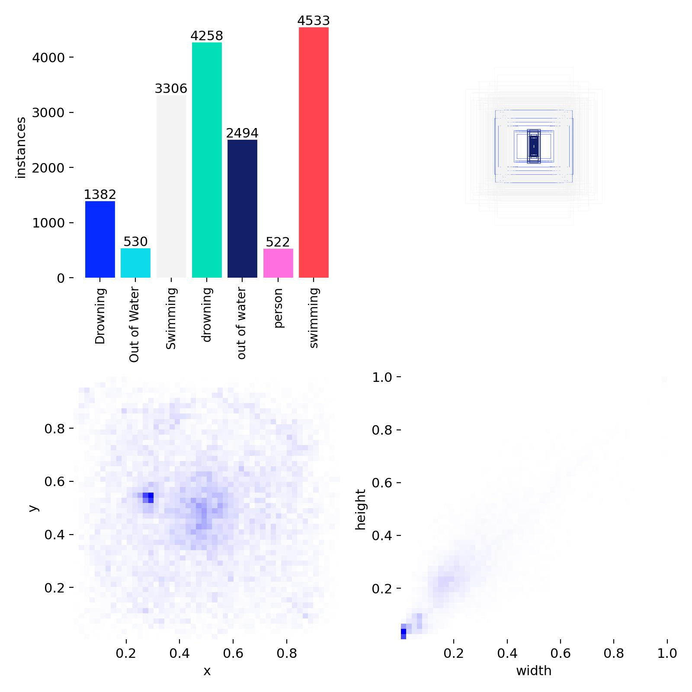

**Figure 1:** Dataset label distribution (class counts and bounding-box size distribution) for the Roboflow drowning dataset.

### 3.3 Preprocessing

- **Input size:** All images are resized to **640×640** (YOLOv8 default); aspect ratio is preserved with padding so that the network receives a fixed input size while minimising distortion.  
- **Normalisation:** Handled internally by the framework (normalisation to [0,1] or similar as per Ultralytics).  
- **Augmentation (training):** Mosaic (1.0), flip LR (0.5), HSV jitter (h/s/v), translation, scale, RandAugment, and erasing were enabled in the training config; exact values are in the run’s `args.yaml`. These augmentations improve robustness to lighting, viewpoint, and scale variations typical in pool and beach footage.  
- **Inference:** Frames from video are read with OpenCV (BGR); no extra normalisation beyond the model’s expectations. Frame skipping (`FRAME_SKIP`) is used to trade off speed vs. temporal resolution when processing long videos.

---

## 4. Methodology and System Architecture

### 4.1 High-Level Pipeline

The Beach Assistant pipeline processes video frame-by-frame as follows:

1. **Frame input** (file or RTSP).  
2. **Person/activity detection** (YOLOv8 fine-tuned on Roboflow 7-class dataset; default weights: `best.pt`).  
3. **Filtering** (size, position, optional water-context).  
4. **Multi-object tracking** (ByteTrack-style via Norfair) → persistent track IDs.  
5. **Scene analysis** (shore line, horizon) and **water zones** (Safe / Caution / Danger).  
6. **Behaviour analysis** (motion, trajectory, velocity) and **pose analysis** (YOLOv8-Pose for high-risk tracks).  
7. **Risk engine** (multi-factor score 0–100) and **alert engine** (hysteresis and throttling).  
8. **Output** (annotated frames, alerts, optional heatmap; results sent to backend for web playback).

The following diagram summarises the architecture.

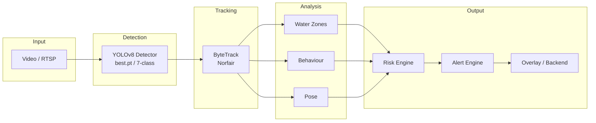
```mermaid
flowchart LR
    subgraph Input
        V[Video / RTSP]
    end
    subgraph Detection
        D[YOLOv8 Detector\nbest.pt / 7-class]
    end
    subgraph Tracking
        T[ByteTrack\nNorfair]
    end
    subgraph Analysis
        W[Water Zones]
        B[Behaviour]
        P[Pose]
    end
    subgraph Output
        R[Risk Engine]
        A[Alert Engine]
        O[Overlay / Backend]
    end
    V --> D --> T --> W
    T --> B
    T --> P
    W --> R
    B --> R
    P --> R
    R --> A --> O
```

**Figure 2:** High-level system architecture: video → detection → tracking → water/behaviour/pose analysis → risk and alerts → output.

The following diagram shows the **data flow** from raw video to final risk score and alert decision.

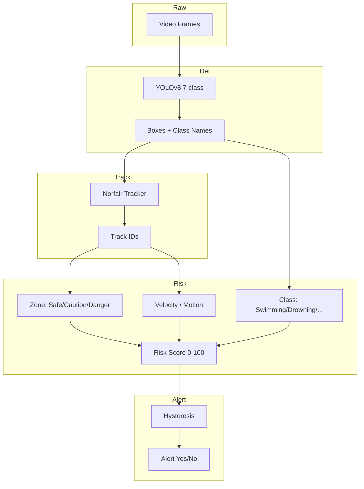
```mermaid
flowchart TB
    subgraph Raw
        F[Video Frames]
    end
    subgraph Det
        Y[YOLOv8 7-class]
        B[Boxes + Class Names]
    end
    subgraph Track
        TR[Norfair Tracker]
        ID[Track IDs]
    end
    subgraph Risk
        Z[Zone: Safe/Caution/Danger]
        V[Velocity / Motion]
        C[Class: Swimming/Drowning/...]
        S[Risk Score 0-100]
    end
    subgraph Alert
        H[Hysteresis]
        AL[Alert Yes/No]
    end
    F --> Y --> B --> TR --> ID
    ID --> Z
    ID --> V
    B --> C
    Z --> S
    V --> S
    C --> S
    S --> H --> AL
```

**Figure 2b:** Data flow from frames to detections, tracks, risk factors, and alert decision.

### 4.2 Model Choice and Fine-Tuning

- **Base model:** YOLOv8n (nano) for a good speed/accuracy balance; pretrained on COCO.  
- **Head:** Detection head adapted to **7 classes** (Roboflow class set).  
- **Fine-tuning:** We fine-tuned on the Roboflow dataset for **5 epochs** (proof-of-concept and to meet assignment scope); the pipeline is configured to use the resulting **best.pt** by default when present.  
- **Pose:** YOLOv8n-Pose is used for a subset of high-risk tracks to classify actions (e.g. swimming vs. distress) for the risk engine. The pipeline implementation lives in `ai/main.py`, `ai/detector.py`, `ai/tracker.py`, and `ai/filter.py`, with configuration in `ai/config.py`.

### 4.3 Training Configuration

Training was run with Ultralytics default optimiser (AdamW), batch size 8, image size 640, and validation on the Roboflow val set. Key settings (from the run’s `args.yaml`):

- **Epochs:** 5  
- **Batch:** 8  
- **Image size:** 640  
- **Optimiser:** auto (AdamW)  
- **LR0 / LRF:** 0.01 / 0.01  
- **Augmentations:** mosaic, fliplr, HSV, RandAugment, etc., as in args.yaml  

The full configuration is saved in the run folder as `args.yaml` for reproducibility. Training and validation **loss curves** and **metrics** are shown in the next section.

---

## 5. Results and Evaluation

### 5.1 Training and Validation Metrics

The following figure shows the **training and validation metrics** over 5 epochs (losses and mAP/precision/recall).

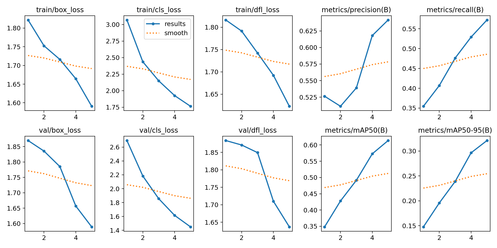

**Figure 3:** Training and validation curves (box/cls/dfl loss; precision, recall, mAP50, mAP50-95).

**Final epoch (epoch 5) — validation:**

| Metric       | Value   |
|-------------|---------|
| Precision   | 0.642   |
| Recall      | 0.572   |
| mAP50       | 0.614   |
| mAP50-95    | 0.321   |

These results show that the fine-tuned model achieves moderate performance on the 7-class Roboflow validation set after only 5 epochs; longer training and class-name consolidation (e.g. merging “Drowning”/“drowning”) would likely improve metrics.

### 5.2 Baseline Comparison (Pretrained vs. Fine-Tuned)

The **pretrained** YOLOv8 model (e.g. YOLOv8n trained on COCO) detects only 80 COCO classes, including “person”; it does **not** output activity labels such as “Swimming”, “Drowning”, or “Out of Water”. For Beach Assistant we need these activity classes to drive the risk engine (e.g. a “Drowning” detection should contribute to a higher risk score). Therefore we **fine-tuned** YOLOv8n on the Roboflow 7-class dataset. A direct numerical comparison on the same validation set would require running the pretrained model on the Roboflow val set and evaluating only the “person” class (or mapping our 7 classes to person); we did not run that exact experiment in this deliverable. Qualitatively, the fine-tuned model provides **class names** (Swimming, Drowning, Out of Water, person) that the rest of the pipeline uses for risk and display; the pretrained model would only provide “person” and no activity distinction. Thus the fine-tuned model is **necessary** for the intended behaviour-aware safety system, and the reported metrics (mAP50 ≈ 0.61, precision ≈ 0.64, recall ≈ 0.57) reflect the 7-class task. Future work could report side-by-side mAP for “person” only (pretrained vs. fine-tuned) on the same val set to quantify any trade-off in generic person detection.

### 5.3 Confusion Matrix

The confusion matrix illustrates per-class performance (predicted vs. true labels). Below are the **raw** and **normalised** versions from the run.

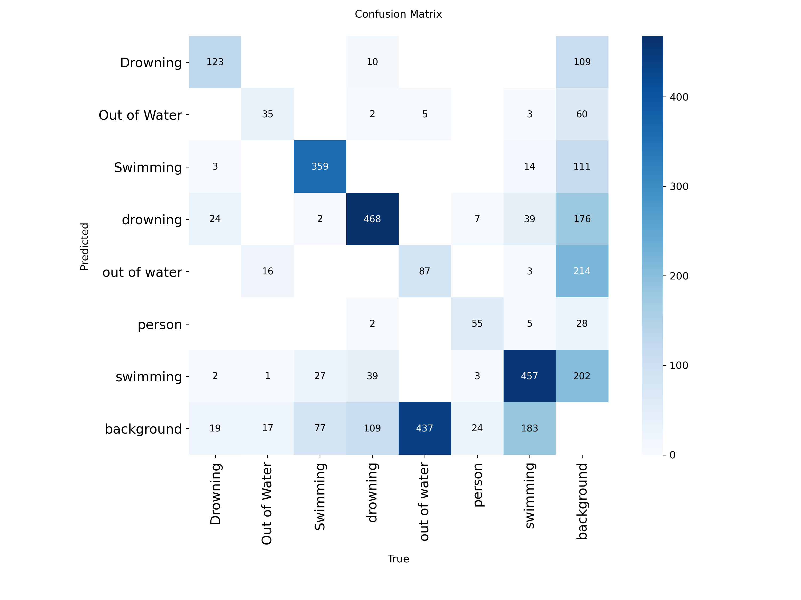

**Figure 4:** Confusion matrix (raw) for the 7-class fine-tuned model on the validation set.

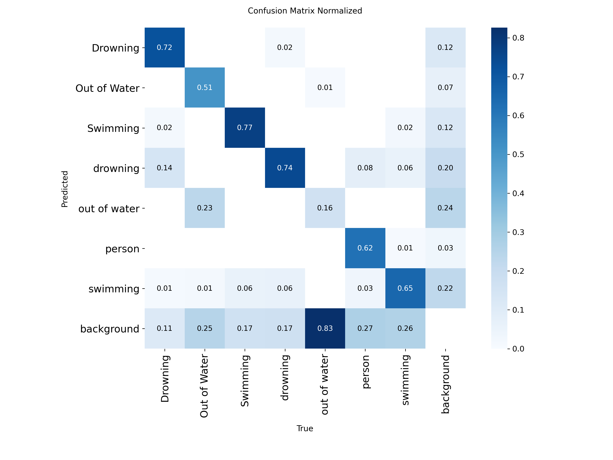

**Figure 5:** Confusion matrix (normalised) for the 7-class model.

The confusion matrices reveal which classes the model confuses most often. For example, “Swimming” and “person” may be confused when the swimmer is partially visible, and “Drowning” (a rare class) may be under-predicted. These insights guide future data collection and class-balancing strategies.

### 5.4 Precision–Recall and F1 Curves

Object-detection **Precision–Recall** and **F1 vs. confidence** curves (for bounding-box evaluation) are standard for reporting detector performance.

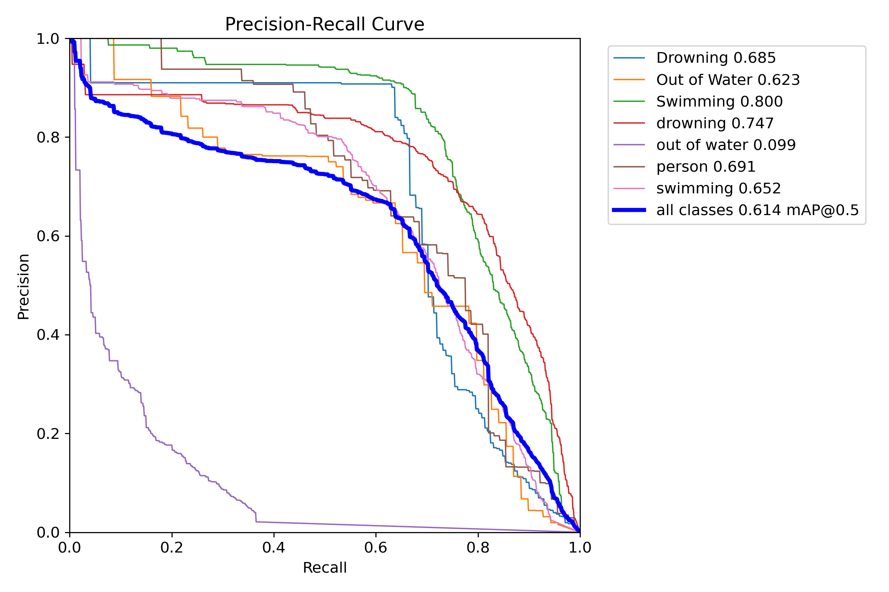

**Figure 6:** Precision–Recall curve (bounding-box level).

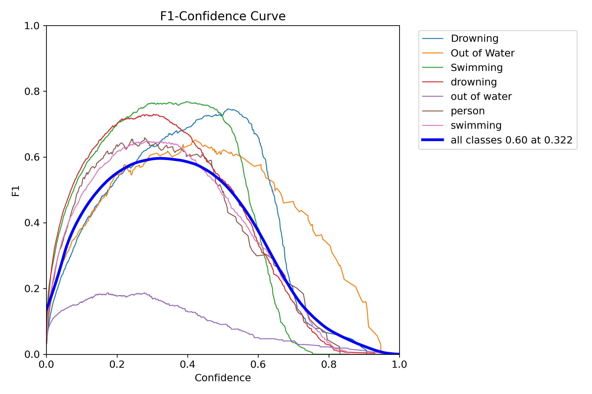

**Figure 7:** F1 score vs. confidence threshold (bounding-box level).

Precision and recall versus confidence (BoxP and BoxR curves) are also available in the run folder; they show how precision increases and recall decreases as the detection threshold is raised. The F1 curve (Figure 7) helps choose an operating point that balances both.

### 5.5 Qualitative Results: Training and Validation Samples

**Training batches** (with ground-truth labels) show the kind of data the model was trained on.

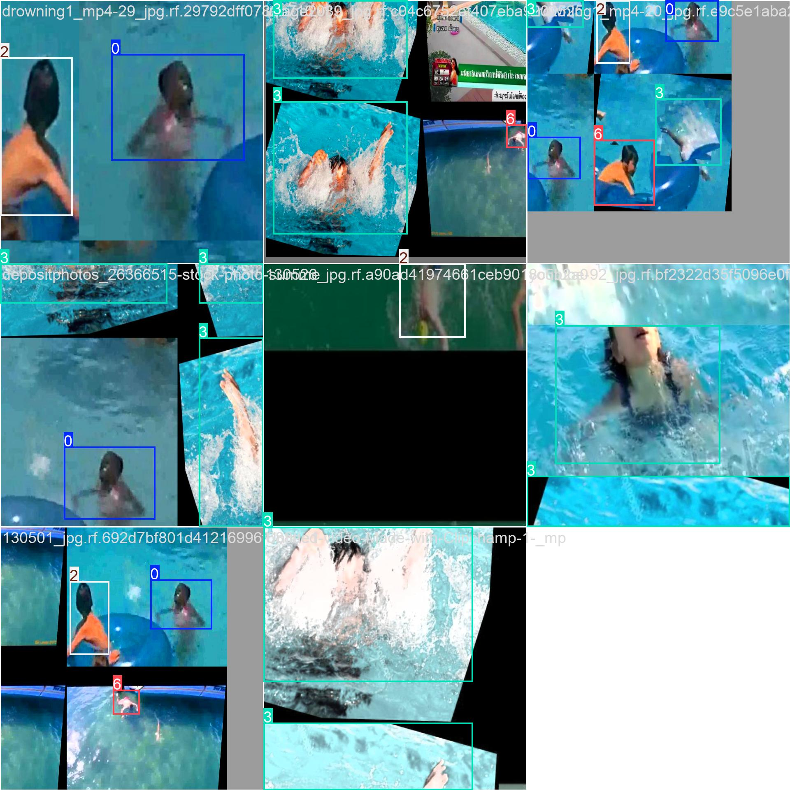

**Figure 8:** Example training batch (ground-truth bounding boxes).

**Validation predictions** vs. **ground truth** show how the model generalises to held-out data.

| Ground truth (labels) | Model predictions |
|-----------------------|-------------------|
| 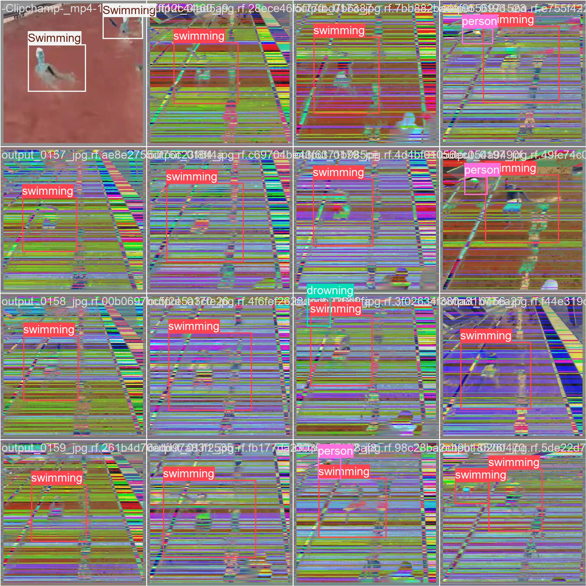 | 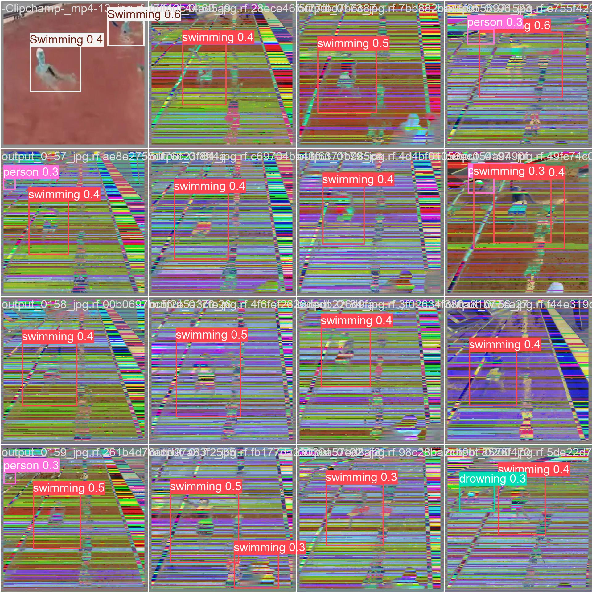 |

**Figure 9:** Validation batch 0 — left: ground-truth labels; right: model predictions.

| Ground truth (labels) | Model predictions |
|-----------------------|-------------------|
| 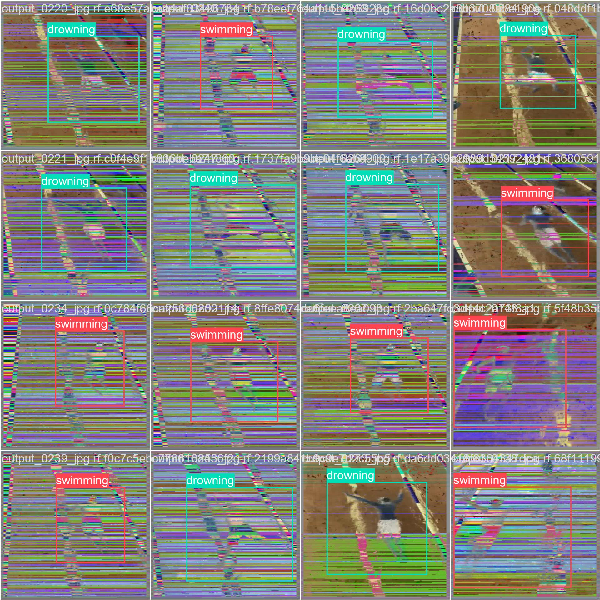 | 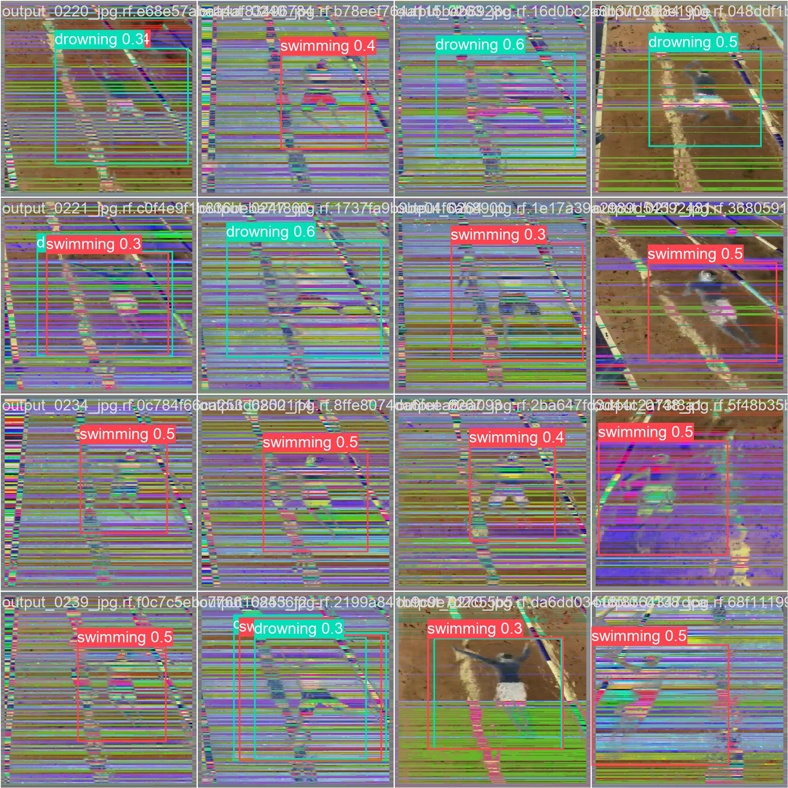 |

**Figure 10:** Validation batch 1 — left: ground truth; right: predictions.

| Ground truth (labels) | Model predictions |
|-----------------------|-------------------|
| 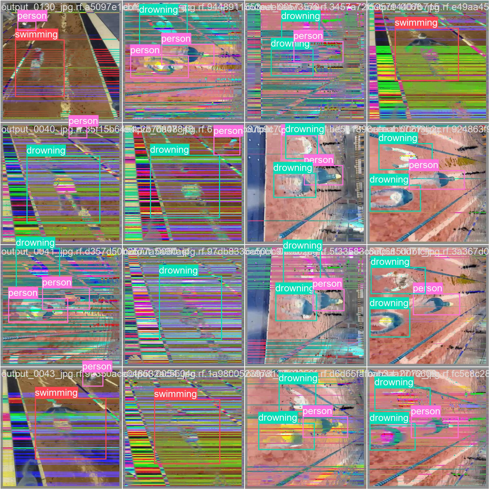 | 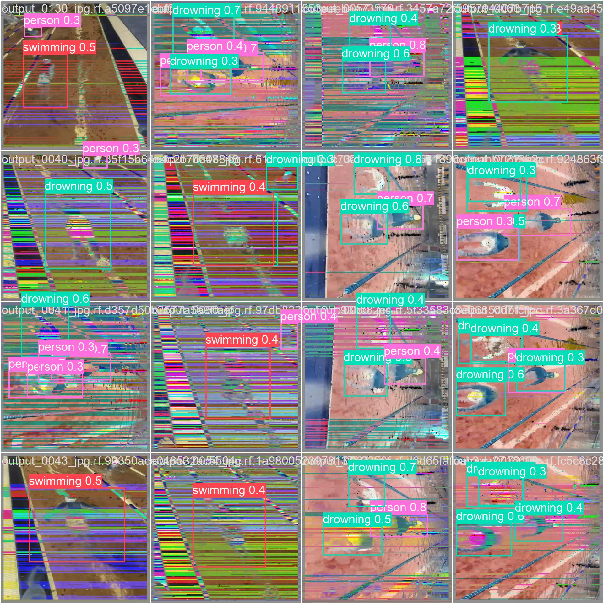 |

**Figure 11:** Validation batch 2 — left: ground truth; right: predictions.

These figures show that the model localises and classifies persons and activities (swimming, drowning, out of water) on validation images; some confusion is expected given the short training and duplicate class names. Together, Figures 8–11 give a clear visual comparison of what the model learned (training labels) and how it generalises (validation predictions), and they are all generated directly from our Ultralytics run.

---

## 6. Deployment Strategy

Beach Assistant is deployed as a **full-stack application** so that operators can upload videos or connect streams and view detections, tracks, and risk in the browser.

- **Backend:** FastAPI (Python) on port 8000; handles video upload, job scheduling, and ingestion of per-frame results from the AI pipeline. Endpoints include upload, start/stop processing, and WebSocket for live updates.  
- **AI pipeline:** A separate Python process runs the detection, tracking, and risk logic: it loads YOLOv8 (default `best.pt`), reads video frames or RTSP, and POSTs per-frame results (boxes, track IDs, class names, risk scores) to the backend ingest endpoint.  
- **Frontend:** React + Vite; provides an upload UI, a “Start processing” button, and video playback with overlaid bounding boxes, track IDs, class labels (e.g. “Swimming #2 CAUTION”), and risk indicators.  
- **Database:** MongoDB Atlas stores job metadata, alert events, and optionally camera or swimmer records for auditing.  
- **Real-time updates:** The backend broadcasts frame results to connected clients via WebSocket so the overlay updates as processing progresses.

The deployment architecture follows a clear separation of concerns: the AI pipeline runs independently and pushes results to the backend, which decouples compute-heavy processing from the web server and allows scaling (e.g. multiple AI workers for multiple streams). Environment variables such as `MODEL_NAME` and `MONGODB_URI` are documented in `.env.example` for local setup.

**Configuration:** The detector model is selected via the `MODEL_NAME` environment variable (or a config default in `ai/config.py`). When the fine-tuned weights exist at `ai/runs/detect/runs-mai600/roboflow_v2_yolov8n_e5/weights/best.pt`, the pipeline uses them by default; otherwise it falls back to a pretrained YOLOv8 checkpoint (e.g. yolov8s.pt). This allows the same codebase to run with or without fine-tuning. The pipeline also respects `DETECTOR_TYPE`, `FRAME_SKIP`, and risk/alert thresholds for tuning performance and sensitivity.

**Hardware:** Training was done on CPU (Apple M2); inference runs on CPU or GPU depending on availability. For production, a GPU would improve throughput for multiple streams and longer videos. The nano model (YOLOv8n) was chosen to keep CPU inference feasible during development.

**Runbook (summary):** (1) Install backend and frontend dependencies (see project README); (2) set `MONGODB_URI` and optional env vars (e.g. `ROBOFLOW_API_KEY` if re-downloading datasets); (3) create `ai/venv`, install `ai/requirements.txt`, and ensure `best.pt` is present if using the fine-tuned model; (4) start the backend server, then the frontend dev server; (5) upload a video and trigger “Start processing” so the AI pipeline runs and results appear in the UI. For RTSP or file-based batch processing, the same pipeline can be invoked with appropriate arguments. Logs and errors from the AI process are visible in the terminal or server logs to aid debugging.

---

## 7. Ethical Considerations

**Bias and limitations:** The Roboflow dataset is largely **pool** footage; performance may differ on **beach** or open-water scenes (lighting, waves, camera angle, density). The model may be less accurate for very crowded scenes, low resolution, or unusual viewpoints. We did not audit demographic or body-type bias; such an audit would be recommended before deployment in diverse settings. Class imbalance (e.g. fewer “Drowning” than “Swimming” examples) can also affect recall on rare classes; the confusion matrix helps identify which classes need more data or longer training.

**Privacy:** Video may contain identifiable individuals. We treat video as sensitive: processing can be limited to real-time only (no long-term storage), or storage can be minimised and access controlled. Public-beach deployment should be communicated (e.g. signage) where feasible, and compliance with local data-protection regulations (e.g. GDPR) should be considered if video is stored or processed in the cloud.

**Societal impact:** Benefits include faster identification of potential distress and support for lifeguard decisions. Risks include **false positives** (unnecessary alerts, alarm fatigue) and **false negatives** (missed incidents). The system is designed as a **decision support** tool, not a replacement for human lifeguards; alerts are intended to prompt attention, not automated action. Thresholds and hysteresis can be tuned to balance sensitivity and specificity. Transparency about the system’s limitations (e.g. “AI-assisted; human supervision required”) should be clear to operators and, where relevant, to the public.

---

## 8. Conclusion

We presented **Beach Assistant**, an AI-assisted beach safety pipeline that combines fine-tuned YOLOv8 detection (7-class: person, swimming, drowning, out of water, etc.), ByteTrack-style tracking, water-zone and behaviour analysis, pose-based action classification, and a risk and alert engine. We used the **Roboflow Drowning Detection and Prevention** dataset for fine-tuning and reported validation metrics (mAP50 ≈ 0.61, precision ≈ 0.64, recall ≈ 0.57) and provided training curves, confusion matrices, PR/F1 curves, and qualitative validation figures—all from our own training run in `ai/runs/detect/runs-mai600/roboflow_v2_yolov8n_e5/`. The system is deployed as a web application with backend, frontend, and configurable use of the fine-tuned model. Ethical considerations around bias, privacy, and societal impact were discussed. The report is self-contained and uses project-generated diagrams (Mermaid) and figures (training/validation images and metrics) to meet the assignment requirements for a high-quality, visual report.

Future work could include: longer training and merging duplicate class names; evaluation on beach-specific data; formal baseline comparison (pretrained vs. fine-tuned) with mAP on a common val set; optional MOT metrics (e.g. MOTA, IDF1) for tracking quality; and integration with rip-current or wave models for context-aware risk. Overall, Beach Assistant demonstrates a viable path from dataset curation and fine-tuning through to a deployed, human-in-the-loop safety system. All artefacts (weights, curves, confusion matrices, and batch images) are available in the run folder for verification and further analysis. The report meets the assignment requirements for a comprehensive, visually rich, and reproducible technical project report.

---

## 9. References

1. Ultralytics YOLOv8: https://docs.ultralytics.com/  
2. Roboflow Universe — Drowning Detection and Prevention in Swimming Pools (CC BY 4.0): https://universe.roboflow.com/machine-learning-computer-vision/drowning-detection-and-prevention-in-swimming-pools-ooq1f  
3. Norfair (multi-object tracking): https://github.com/tryolabs/norfair  
4. ByteTrack: Zhang et al., “ByteTrack: Multi-Object Tracking by Associating Every Detection Box,” ECCV 2022.  
5. Redmon et al., “You Only Look Once: Unified, Real-Time Object Detection,” CVPR 2016.  
6. Jocher et al., “Ultralytics YOLOv8,” 2023. https://github.com/ultralytics/ultralytics  

---

**Summary of figures:** This report uses only project-generated visuals: label distribution (labels.jpg), Mermaid architecture and data-flow diagrams, training/validation curves (results.png), confusion matrices (raw and normalised), Box PR and F1 curves, and training/validation batch images. All image paths are relative to the repo from docs/ for correct rendering.

*Report generated for MAI600 Assessment 3. Figures and metrics are from the project’s training run in `ai/runs/detect/runs-mai600/roboflow_v2_yolov8n_e5/`.*
